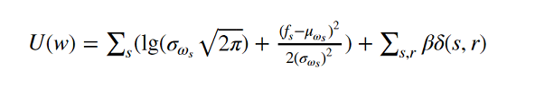
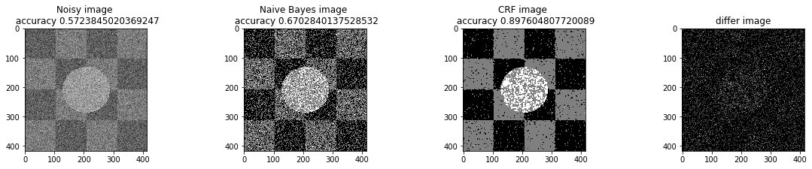
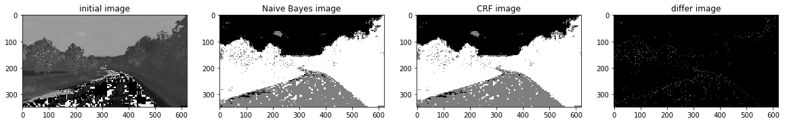
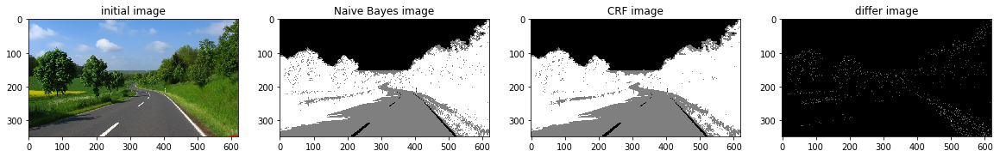

# Markov Random Field For Image Segmentation and Denoising
This project has two parts. In part one, we use markov random field to denoise an image. In Part two, we use similar model for image segmentation. 

 

For a brief read me, click on [Brief Read me](https://github.com/AliMorty/Markov-Random-Field-Project/blob/master/README/README.md) <br>
For checking the code, click on [Codes](https://github.com/AliMorty/Markov-Random-Field-Project/blob/master/Codes/README.md)

 **Update**
 > As some people asked me some questions, I felt it might be helpful to add some notes here:<br>
 > The reference that I have used can be found [here](https://github.com/AliMorty/Markov-Random-Field-Project/raw/master/MRF.pdf)<br>
 > The potential function is equivalent to log(Probability(x)) for any particular image x. We want to find x that maximizes this probability. This image x would be our prediction. We do search for this x using Simulated annealing. 
 

Markov Random Field Models provide a simple and effective way to model the spatial dependencies in image pixels. <br>
So we useed them to model the connection between two neighbour pixels. <br>
In our problem we have to define an energy function on hidden states corresponding to true values of each pixels, then we minimize this function to obtain the best prediction. <br>
Our energy function is defined as below: <br>
 



## Denoising


```python
a_complete_set_for_part_1(arr, max_iter=1e7, var=1e4, betha=1e4)
```





```python
a_complete_set_for_part_1_some_pixels_known(arr,  known_index, max_iter=1e6, var=1e4, betha=bta)
```


## Image Segmentation
In this part, we used Markov Random Field for image segmentation.
<br>
We used different image color space:
- Gray Scale
- HSV
- RGB Format


### Gray Scale


```python
a_complete_set_for_part_2(arr,class_info, max_iter=1e7, betha=1e6)
```


### HSV color space

Now we want to use HSV color space for training our data.


```python
a_complete_set_for_part_2(arr_h,class_info, max_iter=1e6, betha=1e6)
```





### RGB color space
In this part, we used RGB color format in training since there is some information that can be captured by pixels colors.<br> 
We used RGB values in potential function.


```python
a_complete_set_for_part_2_3_color(max_iter=1e6, betha=1e6)
```





```python
a_complete_set_for_part_2_3_color(max_iter=1e6, betha=1e6,
                                 schedule=linear_multiplicative_cooling_schedule, temprature_function_constant=0.5)
```


## Conclusion
Grayscale image format didn't have sufficient information for CRF models in this task.<br>
The value H in HSV image format had better information for segmentation using CRF models. And the result was better. <br>
The RGB format also had good information for segmenting the image. Because these three segments have different colors. So if a CRF model considers colors of the image for classification, then the result is going to be better compared to Grayscale images.
