# Markov Random Field For Image Segmentation and Denoising
### For complete code, check out the folder "Complete version" <br><br>
This project has two parts. In part one, we use markov random field to denoise an image. In Part two, we use similar model for image segmentation. <br>


## Part 1
In this part, we have an image. We add a gussian noise to it. Then we use markov model

### Original Image


```python
path = './test1.bmp'
arr = misc.imread(path, flatten=True)
labels = np.array(arr / 127, dtype=int)
print ("initial image")
imshow(arr, cmap='gray');
```

    initial image
    


```python
tmp = plt.gcf().clear()
```


    <matplotlib.figure.Figure at 0xa6cdb79208>


## Part A
In this part we added noise (with normal distribution) to the image.

### Learn Noise Distribution 
We used neive bayes to learn noise distribution.

### Naive Bayes Classifier
We used naive bayes classifier for predicting the real label of each pixel

## Part B
In this part, we used Naive Bayes classifier defined in part A to classify true labels for each of the image's pixels.


```python
variance_list = [100, 1000, 20000]
for var in variance_list:
    noisy_arr = add_noise(arr, var)
    cls_info = naive_bayes_learning(arr, noisy_arr, labels)
    prediciton_array = naive_bayes_predict(noisy_arr, cls_info)
    print ("Noisy Image with var", var)
    plt.imshow(noisy_arr, cmap='gray')
    plt.show()
    print ("Naive Bayes Classifier Labels")
    plt.imshow(prediciton_array, cmap='gray')
    plt.show()
```

    Noisy Image with var 100
    


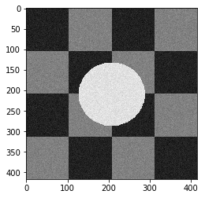


    Naive Bayes Classifier Labels
    


    Noisy Image with var 1000
    


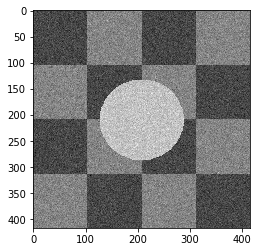


    Naive Bayes Classifier Labels
    


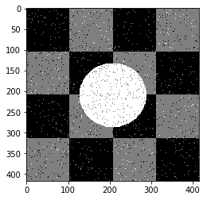


    Noisy Image with var 20000
    


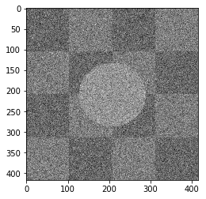


    Naive Bayes Classifier Labels
    


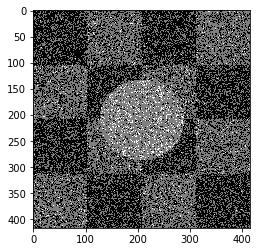


As you can see the results, this approach worked well when the noise variance is 10, but when the noise increases, this approach didn't work well.

## Part C

Markov Random Field Models provide a simple and effective way to model the spatial dependencies in image pixels. <br>
So we useed them to model the connection between two neighbour pixels. <br>
In our problem we have to define an energy function on hidden states corresponding to true values of each pixels, then we minimize this function to obtain the best prediction. <br>
Our energy function is defined as below: <br>
 

$U(w)=\sum_{s} (\lg (\sigma_{\omega_{s}} \sqrt{2 \pi}) + \frac{(f_s - \mu_{\omega_{s}})^2}{2(\sigma_{\omega_{s}})^2}) + \sum_{s,r} \beta \delta (s,r)  $

## Part D
We used naive bayes results of __Part B__ as the initial state for the true pixels values. Then we used simulated annealing optimization method. We tested different hyper pararmeters to compare the performance of the MRF models with  naive bayes model. <br>


```python
plt.figure(figsize=(10, 12), dpi=80, facecolor='w', edgecolor='k')
```


    <matplotlib.figure.Figure at 0xa6cdaeb2b0>


    <matplotlib.figure.Figure at 0xa6cdaeb2b0>


```python
a_complete_set_for_part_1(arr, max_iter=1e6, var=1e4, betha=1e2)
```


```python
a_complete_set_for_part_1(arr, max_iter=1e7, var=1e4, betha=1e4)
```


## Part E
We compared two different modes. First mode uses only four neighbors pixels. Second mode uses eight neighbors pixels in the model. The result is as below.

### Model with four neighbors


```python
plt.figure(figsize=(10, 12), dpi=80, facecolor='w', edgecolor='k')
a_complete_set_for_part_1(arr, max_iter=1e6, var=1e4, betha=1e4)
```


    <matplotlib.figure.Figure at 0x835c997d30>


### Model with eight neighbors


```python
eight_neighbors_indices =  [[0,1],[0,-1],[1,0],[-1,0],[1,1],[1,-1],[-1,1],[-1,-1]]
a_complete_set_for_part_1(arr, max_iter=1e6, var=1e4, betha=1e4, neighbor_indices=eight_neighbors_indices)
```


    <matplotlib.figure.Figure at 0x835cd53d30>


### Comparision
When we used eight neighbours, the smoothness of result increased. The weakness of eight neighbors parameter is that the model can't find a good boundary for the circle in the center. Because circles border are different from rectangles and so the number of same color in the border of circle is less than rectangles border. And the model connot predict well in this situation. If we use lower betha, then the result for the circle is going to be better.


```python
a_complete_set_for_part_1(arr, max_iter=1e6, var=1e4, betha=1e-1, neighbor_indices=eight_neighbors_indices)
```


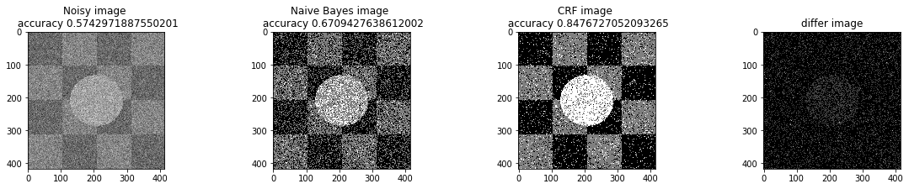


## Part F
In this part, we tested different  $\beta$ as the hyperparameter. And the result is as follow.


```python
bta = 1e-4
print ("Betha", bta)
a_complete_set_for_part_1(arr, max_iter=1e6, var=1e4, betha=bta)
```

    Betha 0.0001
    


```python
bta = 1e-1
print ("Betha", bta)
a_complete_set_for_part_1(arr, max_iter=1e6, var=1e4, betha=bta)
```

    Betha 0.1
    


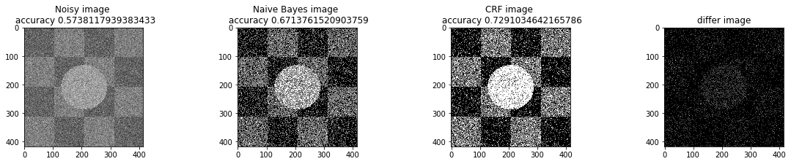


```python
bta = 1e0
print ("Betha", bta)
a_complete_set_for_part_1(arr, max_iter=1e6, var=1e4, betha=bta)
```

    Betha 1.0
    


```python
bta = 1e4
print ("Betha", bta)
a_complete_set_for_part_1(arr, max_iter=1e6, var=1e4, betha=bta)
```

    Betha 10000.0
    


```python
xs = [-4,-3,-2,-1,0,1,2,4]
accs = [0.623, 0.627, .633, .729, .8587, .8581, .8552, .8551]
plt.plot(xs, accs)
plt.show()
```


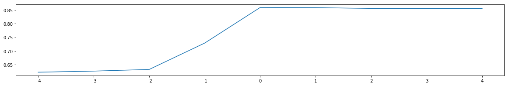


According to the above graph, the best $\beta$ is 1e0=1.

## Part G
In this part, we have some part of the image and we want to predict the remaining part. 


```python
plt.figure(figsize=(10, 12), dpi=80, facecolor='w', edgecolor='k')
known_index = np.zeros((len(arr), len(arr[0])))
for i in range (0, len(arr)):
    for j in range(0, len(arr[0])):
        if (i <= j ):
            known_index[i][j]=1
bta = 1e4
a_complete_set_for_part_1_some_pixels_known(arr,  known_index, max_iter=1e6, var=1e4, betha=bta)
```


    <matplotlib.figure.Figure at 0xa6d9bbad68>


## Part H
In this part, we compared different schedules in simulated annealing optimizer.<br>
We tested different scheduling Strategy. And the result is as follow.

#### Exponential Schedule


```python
a_complete_set_for_part_1(arr, max_iter=1e6, var=1e4, betha=bta,
                          schedule=exponential_schedule, temprature_function_constant=0.8)
```


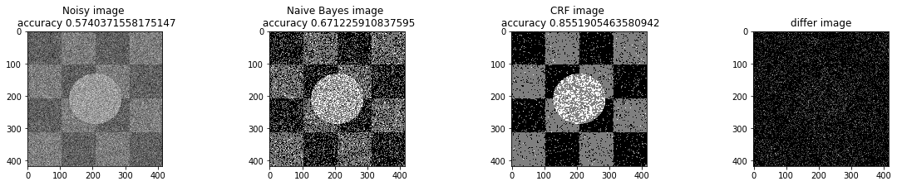


```python
a_complete_set_for_part_1(arr, max_iter=1e6, var=1e4, betha=bta,
                          schedule=exponential_schedule, temprature_function_constant=0.9)
```


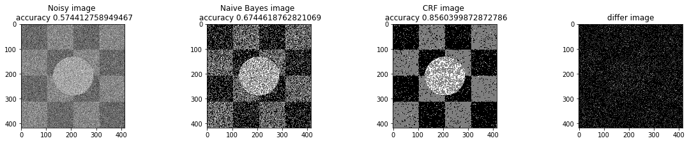


#### Logarithmical Multiplicative Cooling Schedule


```python
a_complete_set_for_part_1(arr, max_iter=1e6, var=1e4, betha=bta,
                          schedule=logarithmical_multiplicative_cooling_schedule, temprature_function_constant=1.0)
```


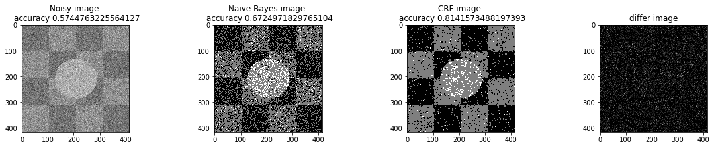


#### Linear Multiplicative Cooling Schedule


```python
a_complete_set_for_part_1(arr, max_iter=1e6, var=1e4, betha=bta,
                          schedule=linear_multiplicative_cooling_schedule, temprature_function_constant=1.0)
```


```python
a_complete_set_for_part_1(arr, max_iter=1e6, var=1e4, betha=bta,
                          schedule=linear_multiplicative_cooling_schedule, temprature_function_constant=0.5)
```


```python
a_complete_set_for_part_1(arr, max_iter=1e6, var=1e4, betha=bta,
                          schedule=linear_multiplicative_cooling_schedule, temprature_function_constant=1.5)
```


## Part 2
In this part, we used Markov Random Field for image segmentation.
<br>
We used different image color space:
- Gray Scale
- HSV
- RGB Format

### Orginal Image


```python
path = "test2-mini.jpg"
arr = misc.imread(path, flatten=True)
print ("initial image")
imshow(arr, cmap='gray');
```

    initial image
    


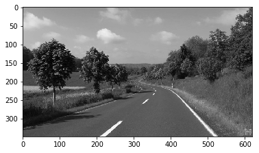


```python
tmp = plt.gcf().clear()
```


    <Figure size 432x288 with 0 Axes>


### Gray Scale

### Naive Bayes Classifier
We used naive bayes classifier for predicting the real label of each pixel


```python
plt.figure(figsize=(16, 18), dpi=80, facecolor='w', edgecolor='k')
a_complete_set_for_part_2(arr,class_info, max_iter=1e4, betha=1e4)
```


    <Figure size 1280x1440 with 0 Axes>


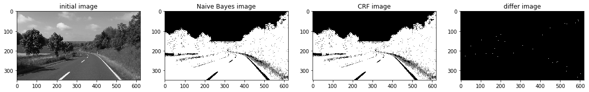


```python
a_complete_set_for_part_2(arr,class_info, max_iter=1e4, betha=1e6)
```


```python
a_complete_set_for_part_2(arr,class_info, max_iter=1e6, betha=1e6)
```


```python
a_complete_set_for_part_2(arr,class_info, max_iter=1e7, betha=1e6)
```


### HSV color space

Now we want to use HSV color space for training our data.


```python
import matplotlib
path = "test2-mini.jpg"
img = Image.open(path)
hsv_arr = matplotlib.colors.rgb_to_hsv(img)
hsv_arr = np.asarray(hsv_arr)
h_arr = hsv_arr[:,:,0]
plt.imshow(h_arr, cmap="gray")
plt.show()
```


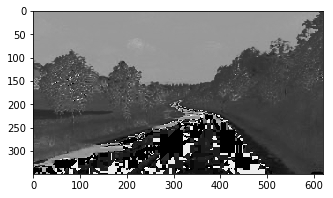


```python
arr_h = read_image_h("test2-mini.jpg")
```


```python
plt.figure(figsize=(16, 18), dpi=80, facecolor='w', edgecolor='k')
a_complete_set_for_part_2(arr_h,class_info, max_iter=1e2, betha=1e4)
```


    <Figure size 1280x1440 with 0 Axes>


```python
a_complete_set_for_part_2(arr_h,class_info, max_iter=1e4, betha=1e4)
```


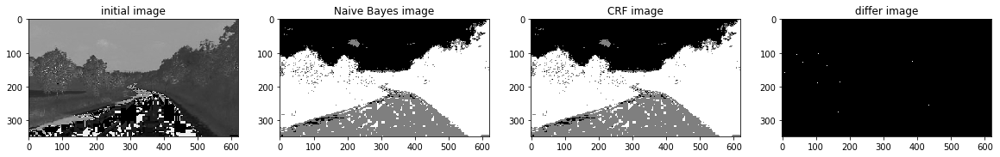


```python
a_complete_set_for_part_2(arr_h,class_info, max_iter=1e6, betha=1e4)
```


```python
a_complete_set_for_part_2(arr_h,class_info, max_iter=1e6, betha=1e6)
```


### RGB color space
In this part, we used RGB color format in training since there is some information that can be captured by pixels colors.<br> 
We used RGB values in potential function.


```python
a_complete_set_for_part_2_3_color(max_iter=1e4, betha=1e4)
```


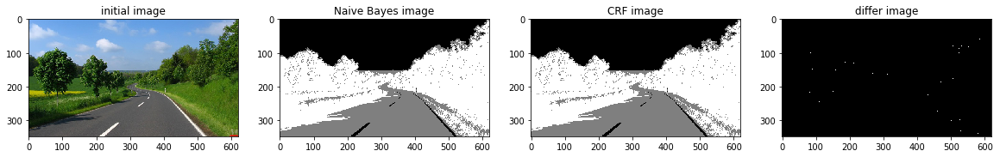


```python
a_complete_set_for_part_2_3_color(max_iter=1e6, betha=1e4)
```


```python
a_complete_set_for_part_2_3_color(max_iter=1e6, betha=1e6)
```


```python
a_complete_set_for_part_2_3_color(max_iter=1e6, betha=1e6,
                                 schedule=linear_multiplicative_cooling_schedule, temprature_function_constant=0.5)
```


```python
np.seterr(all='raise');
a_complete_set_for_part_2_3_color(max_iter=1e6, betha=1e6,
                                 schedule=linear_multiplicative_cooling_schedule, temprature_function_constant=0.5)
```


## Conclusion
Grayscale image format didn't have sufficient information for CRF models in this task.<br>
The value H in HSV image format had better information for segmentation using CRF models. And the result was better. <br>
The RGB format also had good information for segmenting the image. Because these three segments have different colors. So if a CRF model considers colors of the image for classification, then the result is going to be better compared to Grayscale images.
